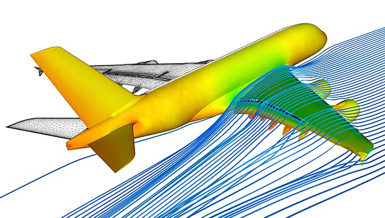

:::::::::::::::::::::::::::::::::::::: questions 

- What is meant by a "model"?
- What is the difference between a mathematical model and a submodel?
- What is model coupling?
- Why would we want to couple simulation models?

::::::::::::::::::::::::::::::::::::::::::::::::

::::::::::::::::::::::::::::::::::::: objectives

- Explain the benefits and downsides of coupling simulation models

::::::::::::::::::::::::::::::::::::::::::::::::

## Introduction
Computer simulations are widely used in modern science to understand and predict the behaviour of natural systems. The computer program that simulates the system is referred to as a "model" of that system. Some models may be very simple e.g. describing the evolution of a 1 dimensional system. Others may be highly complex, involving many different physical processes. A well known use of computer simulation is in the field of weather forecasting, in which a very complex model composed of a multitude of different physical processes must be simulated by a computer program, generally requiring powerful supercomputers. The computer program that simulates a given physical system is known as a _model_ of that system. A given climate simulation code is a _model_ of the Earth's climate, for example.

## Mathematical model vs computational model
For this course, it is important to distinguish between a _mathematical_ model, and a _computational_ model.
A mathematical model refers to the set of mathematical equations that describe the evolution of a given physical system.
The computational model refers to the actual computer program that describes the evolution of a physical system.
These are closely connected concepts - after all, many computational models are just solving a given mathematical model numerically. However, the distinction is important. Some computational models can be simulating many different aspects of a physical system, which could involve solving many different mathematical models.

## What is model coupling?
In short, "coupling" one computational model to another means that we pass information between the models in order to connect them into one big model. If the output of one model can be used as the input of another, for example, then it may be possible to couple them. The models must of course be compatible - at least one model must calculate something that can be used by the other model.

### An example: Making a coupled model of a flying aeroplane
Imagine that we have two computational models: Model A and Model B.
Model A simulates how an aeroplane moves in response to forces on its body.
Model B simulates airflow around objects and calculates the forces generatedby that airflow.
We could pass the shape, speed and rotation of the airplane as input to Model B, allowing it to calculate the forces on the plane.
In turn, we could then pass the calculated forces back to Model A, allowing it to calculate the effect of the forces on the plane's speed, position and rotation.
In this way we have _coupled_ the two models together, making a new, more complex computational model. The two original models are _submodels_ of the coupled model.

{alt='Computational fluid dynamics simulation of airflow over an aeroplane wing.'}

::::::::::::::::::::::::::::::::::::: challenge 

### Exercise: Breaking it down
Think of another physical system you might simulate. Can you think of how to break it down into two or more computational submodels that, when coupled together, simulate the overall system? Most importantly, consider what information would be passed from one model to the other.

:::::::::::::::::::::::: solution 

### Example solution

Weather forecasting

Drug binding:

Stents in blood vessel

:::::::::::::::::::::::::::::::::

## Why couple models together?
It is common in computational science to have many different models for the same system. There are many reasons - wome may be more accurate (and therefore more computationally expensive), while others may implement different theoretical interactions. A scientist or engineer will combine different submodels together to run different computational experiments.

::::::::::::::::::::::::::::::::::::: challenge 

### Why not monolothic?
It is of course possible, and frequently the case, that a single monolithic computer program is created that simulates all aspects of a complex physical system.

:::::::::::::::::::::::: solution 

### Solution

Performance
Ease of swapping new, different models in and out
Separation of concerns
modularity

:::::::::::::::::::::::::::::::::

## Distributed computing

Supercomputers have lots of cores
We can use these to run more quickly
Without supercomputers, weather forecasts would take forever

::::::::::::::::::::::::::::::::::::: keypoints 

- Crossing scales
- Modularity
- Flexibility
- Performance

::::::::::::::::::::::::::::::::::::::::::::::::

[r-markdown]: https://rmarkdown.rstudio.com/
