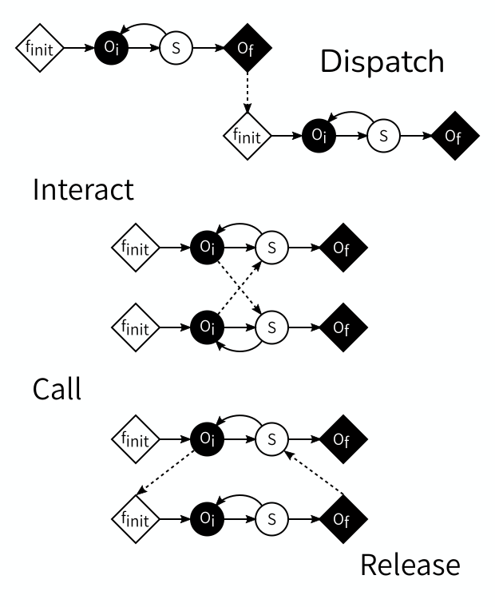

:::::::::::::::::::::::::::::::::::::: questions

- When coupling models together, how do you figure out which information needs
  to be exchanged when?
- How does that depend on the spatial and temporal scales of the simulated
  processes?
- What does that mean for how submodels should be implemented?

::::::::::::::::::::::::::::::::::::::::::::::::

::::::::::::::::::::::::::::::::::::: objectives

- Explain how to couple models using the concepts of the Multiscale Modelling
  and Simulation Framework

::::::::::::::::::::::::::::::::::::::::::::::::

## Introduction

Coupling models can be a difficult task, especially when there are many models
involved that model processes in different ways and at different scales in time
and space. To make a coupled simulation, you need to figure out which
information needs to be passed between which submodels, when it needs to be sent
and received, and how it can be represented, and that can be quite a puzzle.
Fortunately, there is a theory of model coupling that can help you with this.
It is called the Multiscale Modelling and Simulation Framework (MMSF), and
despite its name, it also includes same-scale couplings.

In this episode, we'll work through a slightly extended version of the MMSF's
process for coupling two models representing two processes.

## Domains

Mathematical and simulation models represent some kind of process, which takes
place in a certain location in time and in space: its domain. The weather takes
place in the atmosphere, earthquakes in the Earth's crust, a forest fire in a
forest. In time, that forest fire begins with a lightning strike and ends when
the flames are extinguished, and even continuous processes like the airflow
around an aeroplane wing can be considered to start when circumstances change
and end when a steady state is reached again.

The domains of two models can be the *same*, *overlapping*, *adjacent*, or
*separated*, in both space and time. This is important for the coupling between
them, because it decides what is sent (state or boundary conditions) and when it
is sent.

::::::::::::::::::::::::::::::::::::: challenge

## Challenge 1: Models and domains

Think of two models that could potentially be coupled, and describe each model's
domain in time and space and the relation between them.

Some things to ponder:

- What does it mean for two models to have adjacent time domains?
- What if their spatial domains are separated?

:::::::::::::::::::::::: solution

## Example solution

### Example coupled model

The sun drives local convection in the atmosphere by heating up the Earth's
surface, which then heats up the air above it. We can model how this plays out
over the course of a day by coupling two models:

Model 1 simulates the heating of the Earth's surface as the sun shines on it.
Model 2 simulates the flow of the air above as it warms up and starts rising.
In time, both domains extend from sunrise to sunset. In space, the heating
process takes place on the Earth's surface, while the airflow process operates
on the atmosphere. In time, the domains overlap, while in space they are
adjacent.

### Questions

- If two models have adjacent time domains, then one model starts at the same
  moment that the other ends. Typically, this occurs when one process triggers
  another.
- If the spatial domains of two models are separated, then there is no direct
  exchange of information between the models, unless some kind of remote
  communication is possible. As a result, the models can be run separately and
  don't need to be coupled, unless some other model has a domain adjacent to
  both.

:::::::::::::::::::::::::::::::::
:::::::::::::::::::::::::::::::::::::::::::::::

## Scales

A second important property of a physical process is the scales, again in time
and in space, on which it takes place. A scale can be defined by its grain and
extent. There are many other terms in use for these, but we'll use these here
because they're less ambiguous than most. The *grain* refers to the smallest
detail that the model can represent. In practice, that is usually set by the
timestep (in time), grid spacing, or size of an agent (in space). If these can
vary throughout the domain, pick the smallest. The *extent* refers to the size
of the process in space and time, so the size of its domain. How long does it
take to complete (or to reach a steady state), and how large an area is
modelled?

::::::::::::::::::::::::::::::::::::: challenge

## Challenge 2: Models and scales

What are the scales of the models you previously considered the domains of? What
are their grain and extent in space and in time?

:::::::::::::::::::::::: solution

## Example solution

### Surface

Model 1 simulates the heating of the Earth's surface as the sun shines on it.

The temperature of the Earth's surface only changes slowly during the day, and
we can probably say there are no significant changes from one minute to the
next, or even for a somewhat larger interval. So the time grain of model 1 is on
the order of a few minutes, perhaps up to an hour. The time extent of the model
is one day, as it will repeat itself after that.

In space, the grain depends on the research question, and could be as small as
10cm if we are looking at the detailed thermal environment around a building, or
as large as a few kilometers if we want to make a national weather forecast. The
extent is the size of the area of study.

### Atmosphere

Model 2 simulates the flow of the air above as it warms up and starts rising.
This is probably done using a computational fluid dynamics model. Both the
temporal and spatial scales will depend on the research question here, and
grains (time steps and grid spacing) may range from milliseconds and centimeters
to minutes and kilometers. The spatial extent may be the same as that of Model
1, but it could be larger if a very tall column of air is modeled. In time, the
atmosphere won't reach a static equilibrium, but we could choose to run the
simulation for the course of a day and use that as the temporal extent.

Note that you often cannot give an exact number, and that the scales are often
something of a modeling decision. That's usually alright, as we will see below.

:::::::::::::::::::::::::::::::::
:::::::::::::::::::::::::::::::::::::::::::::::

Just like with domains, the scales of two models can be compared and their
relation determined. The Scale Separation Map (SSM) is a nice tool for this. The
SSM is a graph with on its horizontal axis a range of durations, and on its
vertical axis a range of sizes. Each model can then be plotted as a box, with
the left edge at the temporal grain, the right edge at the temporal extent, the
lower edge at the spatial grain, and the upper edge at the spatial extent. Here
is an example:

{alt='2D plot with time on the horizontal
axis and space on the vertical axis. In the center there is a box, which is
surrounded by dashed boxes labelled a through h.'}

The SSM may look very counterintuitive at first, because we are used to plotting
locations, not sizes. So look at the graph carefully and think about what you
see and what it means. It does get easier to understand once you get the hang of
it.

As you can see, we can plot multiple models on a Scale Separation Map and when
we do, the map shows the relationship between the scales of two models. Both
horizontally and vertically, model rectangles can have a gap between them (i.e.
be separated), or be adjacent, or overlap, and the corresponding models are said
to be scale separated, scale adjacent or scale overlapping in space and/or in
time.

For coupling, it is actually only these relationships that matter. Even if you
don't know the exact grain or extent of a particular model, you can often decide
whether it's smaller, larger or the same as the grain or extent of another model
and draw them correspondingly.

::::::::::::::::::::::::::::::::::::: challenge

## Challenge 3: Scale Separation Map

- What are the relations of scales a through h in the figure relative to the
  reference scale?
- Draw a scale separation map for the models you would like to couple.

:::::::::::::::::::::::: solution

## Example solution

### Scale relations

a. Spatially (larger) and temporally (faster) scale separated.
b. Spatially scale adjacent (larger), tomporally scale overlapping.
c. Spatially scale adjacent (larger), temporally scale adjacent (larger).
d. Spatially scale overlapping, temporally scale adjacent (smaller).
e. Spatially scale overlapping, temporally scale separated (slower).
f. Spatially and temporally scale overlapping.
g. Spatially scale adjacent (smaller) and temporally scale separated (faster).
h. Spatially scale separated (smaller) and temporally scale adjacent (slower).

### Scale Separation Map

{alt='2D plot showing one
large box for the atmosphere model, ranging from 1 second to 1 day and 10 cm to
100 m, and a smaller overlapping box for the surface heating model ranging from
10 mn to 1 day and 1m to 100m.'}

:::::::::::::::::::::::::::::::::
:::::::::::::::::::::::::::::::::::::::::::::::

## Models

So far, we have talked about domains and scales of models, which we can do based
on the physical properties of the modelled system, and the research questions we
ask about that system. In order to be able to technically couple models however,
we need to know what a model is. In the MMSF, this is done using a universal
model-of-a-model called the Submodel Execution Loop (SEL):

{alt='Diagram showing a
diamond marked f init, a circle marked O i, another circle marked S, and
another diamond marked O f connected by arrows in order. Another arrow loops
back from S to O i. A dashed arrow points into f init, another dashed arrow
points away from O i, another points into S and a fourth dashed arrow points
away from O f. The circle marked O i and the diamond marked O f are white on
black, the others black on white.'}

According to the MMSF, each model starts by initialising itself, a stage (or
*operator*) known as `F_INIT`. This puts the model into its initial state.
During `F_INIT`, information may be received from other models in a coupled
simulation, which the model can use to initialise itself.

Second, some output based on that state is produced in the `O_I` operator. This
is Intermediate Output, or, looking from the outside in, we Observe an
Intermediate state, hence `O_I`. This output may be sent to other models, where
it can for example be used as boundary conditions.

Third, a state update may be performed using the `S` operator, which moves the
model to its next state (timestep). During `S`, information may be received from
other models to help perform the state update.

After `S`, the model may loop back to before `O_I`, and repeat those two
operators for a while, until the end of the time scale is reached. This leaves
the model with a final state, which may be output in the `O_F` operator (for
Final output or observation).

This basic model is quite flexible. If the loop is run zero times, then the
model is a simple function. Timesteps may be of any length, and vary during the
run, and the model may decide to stop and exit the state update loop at any
time. The state may represent anything at all in any way, and it may be updated
in whichever way is suitable for the model. Any simulation code you may want to
use is very likely to fit these minimal constraints.

## Coupling templates

Now that we know what a model is and how models may be related in terms of their
domains and scales, we can decide how to set up the coupled simulation. We do
this by looking at all pairs of two models under consideration, one pair at a
time, and consider the relationships between their temporal and spatial scales
as well as their domains.

Of the different properties, those governing time are the most interesting, and
also potentially the most confusing. Let's look at the possible scenarios one by
one.

### Adjacent or separated time domains

A simple case is when the time domains are adjacent, meaning one process starts
right when the other process finishes, or separated, meaning one process starts
some time after the other process finishes. In this case, the final output of
the first model is used to initialise the subsequent model.

### Overlapping time domains and the same temporal scale

If two processes do not happen one after the other, then they occur at least
partially simultaneously, and their models have overlapping time domains. The
simplest among these cases is when the two processes start and end at the same
time, and have the same timestep. In that case, each model updates its state
to the next timestep, then sends some information based on the new state (e.g.
boundary conditions) to the other model, receives information from the other
model in return, and goes to do the next state update.

### Overlapping time domains and temporal scale separation

A third interesting case is when two processes happen at the same time, but one
process is much faster than the other, so that it runs to completion in (much)
less time than it takes the other to do a timestep. In that case, the fast
model needs to do an entire run for every timestep of the slow model.

::::::::::::::::::::::::::::::::::::: challenge

## Challenge 4: Coupling Submodel Execution Loops

We can represent each of the two models in the scenarios above as a Submodel
Execution Loop. To connect the models, we then have to send information between
the operators of the models. For each of the three cases, figure out how to
connect the Submodel Execution Loops of the two models so that the correct
communication pattern is implemented.

:::::::::::::::::::::::: solution

## Example solution

If the time domains are adjacent or separated, then the final output of the
first model is used to initialise the subsequent model. We can implement this
by sending information from the first model's `O_F` to the second model's
`F_INIT`.

If the temporal scales are the same, then the models exchange information every
time they have a new state. This can be done by connecting each model's `O_I`
to the other model's `S`, thus sending information at each step.

In case of temporal scale separation, the fast model needs to be reinitialised
at every timestep of the slow model, do an entire run, and return some
information based on its final state to the slow model. This can be
accomplished by sending from the slow model's `O_I` to the fast model's
`F_INIT` and from the fast model's `O_F` back to the slow model's `S`.

:::::::::::::::::::::::::::::::::
:::::::::::::::::::::::::::::::::::::::::::::::

## Coupling Templates

{alt='Three diagrams of
the coupling templates. Each diagram shows two submodel execution loops. The
first diagram is titled Dispatch. In it, O_F on the first SEL is connected to
F_INIT on the second SEL. The second diagram is titled Interact. In it, O_I on
each SEL is connected to S on the other. The third diagram is titled Call and
Release. O_I on the first SEL is connected to F_INIT on the second, this is
Call. O_F on the second SEL is connected to S on the first, this is Release.'}

These three cases demonstrate the four *Coupling Templates* defined by the
MMSF. The first one, `O_F` to `F_INIT`, is called *dispatch*. The second one,
`O_I` to `S` is called *interact*, and usually comes in pairs. The third one
and the fourth one usually go together, as the combination *call* (`O_I` to
`F_INIT`) and *release* (`O_F` to `S`).

Given the constraints of which operators can send and which can receive, these
are in fact all four possible types of connections, and between them they cover
all kinds of temporal scale relations.

If the time domains or time scales overlap, but are not equivalent, then an
additional component is needed that sits between the models; we will not go
into that advanced use case here.

## Spatial scale relations and multiplicity

Having discussed temporal scales, let's move on to the spatial scales. Like
with scales in time, scales in space can be the same, overlap, be adjacent or
be separated, and you can see which one you have by looking at your Scale
Separation Map.

### Same spatial domain and scale

This is a very tight coupling, where usually the two processes end up in a
single equation on the theory side, and in a single code in the implementation.
Unless there is temporal scale separation, it's probably better to combine the
models into a single implementation. In case of temporal scale separation, a
call-and-release template may be used and the state is passed back and forth
between the models.

### Same spatial domain, adjacent or separated scales

If one process is much smaller than the other, then the entire small process
takes place within one grid cell or agent of the larger process. Frequently,
this means that there are multiple instances of the smaller model, maybe even
one for each grid cell or agent, with communication between the large-scale
model and each small-scale model instance. Some kind of iterative equilibration
between the models may be needed to reconcile the two representations of the
state.

### Adjacent spatial domains, same or overlapping spatial scales

If two processes are of similar size and resolution, but occur on adjacent
domains, then they will each have their own state, and exchange boundary
conditions. If there's a temporal scale separation between them, then the
call-and-release coupling template is used and the called (fast) model keeps
its state in between calls.

::::::::::::::::::::::::::::::::::::: challenge

## Challenge 5: Spatial relations

Think of an example for each of the above spatial domain and scale relations.
Can you think of examples that don't fit any of them?

:::::::::::::::::::::::: solution

## Example solution

- Reaction-diffusion models have the two processes acting on the same domain and
  spatial scale, but may be temporally scale-separated depending on parameter
  values.
- A crack propagation model coupling a continuum representation of a material
  sample to molecular mechanics models at specific points. Stresses and strains
  are exchanged in this case.
- In a simulation of In-Stent Restenosis, a complication of vascular surgery, a
  cell growth process in the wall of an artery is coupled with a fluid dynamics
  simulation of the blood flow through the artery. The domains are adjacent and
  boundary conditions are exchanged.

:::::::::::::::::::::::::::::::::
:::::::::::::::::::::::::::::::::::::::::::::::

::::::::::::::::::::::::::::::::::::: keypoints

- Physical processes take place on a domain and at certain scales in time and
  space
- Simulation models are described by the Submodel Execution Loop
- Given two models and their domains and scales, we can decide which coupling
  template to use to connect them
- An MMSL diagram can be used to visualise a complete coupled simulation

:::::::::::::::::::::::::::::::::::::::::::::::
