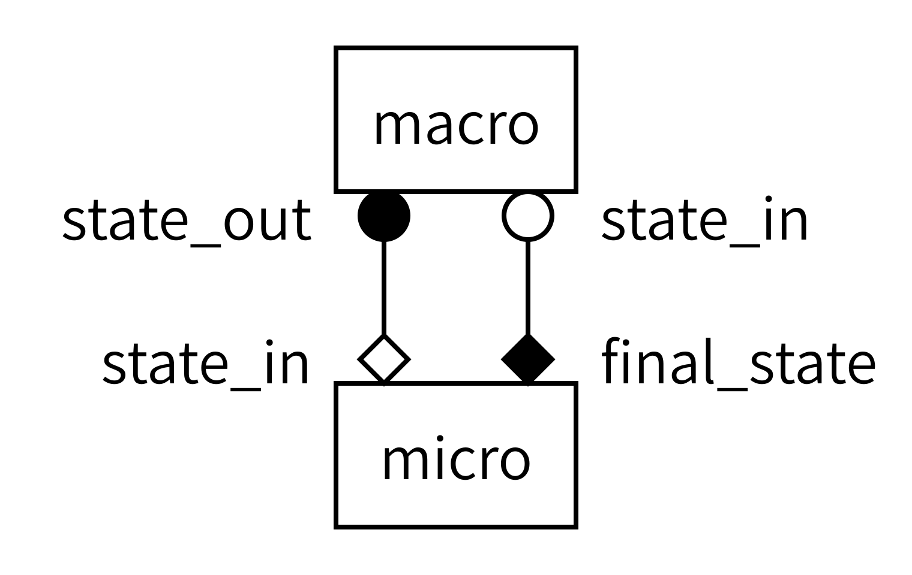

::: questions

- How do you connect an existing python model code to MUSCLE3?

:::

::: objectives

- Identify the inputs and outputs of your submodel and link them to ports
- Recognize the Submodel Execution Loop structure in your code
- Learn to connect a simple model to the MUSCLE3 library

:::

## Introduction

::: instructor

- MUSCLE3 makes coupled simulations easy
- Made by UvA-CSL and NLeSC
- Example model: 1D reaction-diffusion
    - Concentration of a chemical in a 1D container
    - Time-scale separated -> call and release
    - Same spatial domain -> exchange state
- MUSCLE3 has three components: libmuscle, manager, ymmsl-python
- Connect model to libmuscle, here the (fast) micromodel (reaction)

:::

MUSCLE3 is the third incarnation of the Multiscale Coupling Library and Environment. MUSCLE and the MMSF were developed at the University of Amsterdam Computational Science Lab, and MUSCLE3 is the result of a collaboration with the Netherlands eScience Center. MUSCLE3's purpose is to make creating coupled multiscale simulations easy. MUSCLE3 uses the Multiscale Modelling and Simulation Language (MMSL) to describe the structure of a multiscale model, and you will notice that the terminology in MUSCLE3 closely links to what you have learned in the previous episode about MMSF.

In this episode, we will be connecting a small model to MUSCLE3, so that we can connect it to a second model in the next episode.

### Reaction-diffusion model

The example model for this course is a 1-dimensional reaction-diffusion model. This model models a 1-dimensional medium in which some chemical is constantly destroyed by a reaction, while it is also diffusing through the medium. A reaction submodel models exponential growth (or decline in this case, with a negative parameter) for each cell in the 1D grid.  A diffusion submodel models diffusion through the 1D grid. This model is not very realistic, but we're interested in the coupling, not in reaction-diffusion dynamics, so the simpler the better.

Reaction-diffusion models are a traditional example case for multiscale modelling because depending on the parameters used, they may be time-scale overlapping, adjacent or separated. In this example, we're going to configure the diffusion model to be much slower than the reaction model, resulting in temporal scale separation.

To find out how to connect the models, we need to apply the MMSF to this particular situation. The reaction and diffusion processes act simultaneously on the same spatial and temporal domain. The discretisation of that domain in space is also the same for the two models, so that they have the same spatial scale. And there is temporal scale separation. According to the MMSF, that means that we have to use the Call-and-Release coupling template, with one instance of each submodel:

{alt='gMMSL diagram for the reaction-diffusion model. Two boxes labeled macro and micro represent the two submodels. A line connects a filled circle labeled state_out on macro to an open diamond labeled state_in on micro. A second line connects a filled diamond labeled final_state on micro to an open circle labeled state_in on macro.'}

As you can see, each model will send and receive data on two operators, and we will connect them together as shown to form the full simulation.

### MUSCLE3

Before we can create our coupled simulation however, we will need to connect each submodel to MUSCLE3. MUSCLE3 consist of three components:

**libmuscle** is a library that is used to connect component intances (e.g new or existing submodels) to a coupled simulation.

**muscle_manager** is the central manager of MUSCLE3 that starts up submodels and coordinates their interaction.

**ymmsl-python** is a Python library that contains class definitions to represent an MMSL model description. A yMMSL file serves as the interface between us (humans) and the muscle manager and is meant to describe the multiscale simulation and tell the muscle manager what to do.

Here, we will connect the reaction submodel (the micromodel) to the `libmuscle` library step by step. We'll use yMMSL and the manager in the next episode.

## Dissect your model

::: instructor

- Reaction function is a very small (but typical) model code
    - Copy the state from the input to avoid overwriting it

- Challenge 1: Edit your local `reaction.py`
:::

 Open the file called `reaction.py` from the data folder that you downloaded in the setup section in a text editor. It contains a function called `reaction` that requires a `numpy.array` as input and returns another after doing some operations.

```python
def reaction(initial_state: np.array) -> np.array:
    """
    ...
    """
    t_max = 2.469136e-6
    dt = 2.469136e-8
    k = -4.05e4

    U = initial_state.copy()

    t_cur = 0
    while t_cur + dt < t_max:
        U += k * U * dt
        t_cur += dt

    return U
```

The function starts with defining some parameters that are used for the calculations in the main `while` loop. The `initial_state` is copied to a new working state `U` before the simulation starts.

::: callout

## Why .copy()?

Instead of using `.copy()`, we could also just assign `U` to equal the initial state (e.g. `U = initial_state`). For this particular example it would not matter since we do not use `initial_state` anymore. But if we did that, we would change the contents of `initial_state` every time we do an operation on `U`, because both variables would point to the same object. Since the variable is called `initial_state` it would be very confusing if it would change during the model execution. When you want to expand or change the model later on, it can be dangerous if variables do not behave as their name suggests.
:::

At every iteration of the loop, the state `U` is updated by adding a fraction of the old state, scaled by the parameter k and the size of a time step. Also the time counter `t_cur` is incremented with one time step. The `while` loop continues to run until `t_cur` has reached the value of the parameter `t_max`. Finally, when it exits the loop, the function returns the updated state `U`.

::: challenge

## Challenge 1: Can you recognize the Submodel Execution Loop?

 In the previous episode we have discussed the Submodel Execution Loop (SEL) and the various operators that are associated with it. In the code of the `reaction` function, can you recognize the beginning and end of the four operators ($f_{init}$, $O_i$, $S$ and $O_f$ ) plus the state update loop in this submodel? Mark these by placing the following 10 comments in the code:

- `# begin F_INIT`
- `# end F_INIT`
- `# begin O_I`
- `# end O_I`
- `# begin S`
- `# end S`
- `# begin state_update_loop`
- `# end state_update_loop`
- `# begin O_F`
- `# end O_F`

:::::: solution

## Solution

```python
def reaction(initial_state: np.array) -> np.array:
    """
    ...
    """
    # begin F_INIT
    t_max = 2.469136e-6
    dt = 2.469136e-8
    k = -4.05e4

    U = initial_state

    t_cur = 0
    # end F_INIT

    # begin state_update_loop
    while t_cur + dt < t_max:
        # begin O_I
        # end O_I

        # begin S
        U += k * U * dt
        t_cur += dt
        # end S
    # end state_update_loop

    # begin O_F
    return U
    # end O_F
```

$f_{init}$ is where everything gets initialised, at the top of the function. This is not just the state, but also parameters and helper variables. Then, the Submodel Execution Loop specifies two operators within the state update loop. $O_i$ comes before $S$ and you can use it to send information to the outside world with (part of) the current state. $O_i$ is empty here, because this original model didn't produce any output for each state. It did update its state however, so that part of the code is in $S$. Finally, returning a result falls under $O_f$.

:::::

:::

## Creating an Instance object

::: instructor

- Instance represents this model instance to the coupled simulation
- Send and receive messages on ports (don't know what's connected!)
- Challenge (in the shared document, then discuss)
    - What are good names for the ports?
    - Which operators do they need to be associated with?

:::

To let a model communicate with the muscle manager, other submodels and the outside world, we need to create a `libmuscle.Instance` object. An instance is a running submodel, and the Instance object represents this particular instance to MUSCLE3:

```python
from libmuscle import Instance
from ymmsl import Operator

def some_example_submodel():
    instance = Instance({
            Operator.F_INIT: ['initial_state_a', 'initial_state_b'],
            Operator.O_I: ['some_intermediate_state'],
            Operator.S: ['some_other_intermediate_state'],
            Operator.O_F: ['final_state_a', 'final_state_b']})
```

The constructor takes a single argument, a dictionary that maps `ymmsl.Operator` objects to lists of ports. Ports are used to communicate with other simulation components. They have a name, and they are associated with a Submodel Execution Loop operator, which determines whether they are input or output ports. The operator that they are mapped to determines how the port is used, as explained in the previous episode. The names of the available operators correspond to their theoretical counterparts ($f_{init}$, $O_i$, $S$ and $O_f$ ).

::: challenge

## What ports do we need?

Question: In our example of the reaction submodel, what ports do we need to communicate the model state to the outside world? Come up with good names. What operators would we need to map them to?

:::::: solution

In this model, we need:

- a single input port that will receive an initial state (e.g. named "initial_state") at the beginning of the model run and it should be mapped to the $f_{init}$ operator
- a single output port that sends the final state (e.g. named "final_state") at the end of the reaction simulation to the rest of the simulation, it should be mapped to the $O_f$ operator
::::::

:::

## The reuse loop

::: instructor

- Sometimes a model needs to run many times, depending on how it's connected
- MUSCLE3 can figure that out, but we do need to add a loop to implement it
- Challenge 2: Add an Instance and a reuse loop

:::

In multiscale coupled simulations, submodels often have to run multiple times, for instance because they are used as a micro model or because they are part of an ensemble that cannot be completely parallelised. To make this possible, we will wrap the entire submodel in a loop, the so-called reuse loop. Exactly when this loop needs to end often depends on the behaviour of the whole model, and is not easy to determine in advance, but fortunately MUSCLE will do that for us if we call the `Instance.reuse_instance()` method.

```python
    while instance.reuse_instance():
        # F_INIT
        # State update loop
        # O_F
```

::: challenge

## Challenge 2: Creating an Instance and adding a loop

Add the following to our reaction model code:

- a `libmuscle.Instance` object with the appropriate operator-port dictionary
- the reuse loop

:::: solution

```python
from libmuscle import Instance
from ymmsl import Operator

def reaction(initial_state: np.array) -> np.array:
    """
    ...
    """
    instance = Instance({
            Operator.F_INIT: ['initial_state'],       # np.array
            Operator.O_F: ['final_state']})           # np.array

    while instance.reuse_instance():
        # begin F_INIT
        t_max = 2.469136e-6
        dt = 2.469136e-8
        k = -4.05e4

        U = initial_state

        t_cur = 0
        # end F_INIT

        # begin state_update_loop
        while t_cur + dt < t_max:
            # begin O_I
            # end O_I

            # begin S
            U += k * U * dt
            t_cur += dt
            # end S
        # end state_update_loop

        # begin O_F
        return U
        # end O_F
```

Note that the type of data that is sent is documented in a comment. This is obviously not required, but it makes life a lot easier if someone else needs to use the code or you haven’t looked at it for a while, so it’s highly recommended. MUSCLE3 does not require you to fix the type of the messages you're sending to a port in advance; in principle you could send a different type of message every time you send something. The latter is a bad idea, but the flexibility makes development much easier.

::::

:::

## Settings

::: instructor

- Handy to have all the settings together in one place
- Models get them via the instance object (see syntax)
    - Optionally type check (not so optionally in C++ and Fortran)
- Challenge 3: individually: get your settings from MUSCLE3 instead of hard-coding them

:::

Next is the first part of the model, in which the model is initialised. Nearly every model needs some settings that define how it behaves (e.g. the size of a timestep or model specific parameters). With MUSCLE, we can specify settings for each submodel in a central configuration file, and get those settings from `libmuscle` in the model code. This way, we don't have to change our model code every time if we want to try a range of values (for instance, to perform a sensitivity analysis). We can use the `Instance.get_setting` function instead to ask the MUSCLE manager for the values. Putting the values in the configuration file will be covered in the next episode, here we'll look at how to get them from `libmuscle`.

```python
    some_variable = instance.get_setting('variable_name', 'variable_type')
```

::: callout

## Type checking

The second argument, which specifies the expected type, is optional. If it is given, MUSCLE will check that the user specified a value of the correct type, and if not raise an exception.
:::

::: challenge

## Challenge 3:

In our example, several settings have been hard-coded into the model:

- the total simulation time to run this sub-model, `t_max`
- the time step to use, `dt`
- and the model parameter, `k`

Change the code such that we request these settings from the MUSCLE manager.

:::::: solution

```python
from libmuscle import Instance
from ymmsl import Operator

def reaction(initial_state: np.array) -> np.array:
    """
    ...
    """
    instance = Instance({
            Operator.F_INIT: ['initial_state'],       # np.array
            Operator.O_F: ['final_state']})           # np.array

    while instance.reuse_instance():
        # begin F_INIT
        t_max = instance.get_setting('t_max', 'float')
        dt = instance.get_setting('dt', 'float')
        k = instance.get_setting('k', 'float')

        U = initial_state

        t_cur = 0
        # end F_INIT

        # begin state_update_loop
        ...
```

Note that getting settings needs to happen within the reuse loop; doing it before can lead to incorrect results.

::::::

:::

## Receiving messages

::: instructor

- Now, we need to receive our initial state from the appropriate port
- `msg.data` will be a MUSCLE3 Grid object, an array with annotated indices
- Explain syntax in example
    - Need to copy here too, as the received message is read-only
    - Timestamp has simulation time the data corresponds to

:::

Apart from settings, we can use the `Instance.receive` function to receive an initial state for this submodel on the `initial_state` port. Note that we have declared that port above, and declared it to be associated with the `F_INIT` operator. During `F_INIT`, messages can only be received, not sent, so that declaration makes `initial_state` a receiving port.

The message that we will receive can contain several pieces of information. For now, we are interested in the `data` and `timestamp` attributes. We assume the data to be a grid of floats containing our initial state and the time stamp tells us the simulated time at which this state is valid. We can receive a message and store the `data` and `timestamp` attributes in the following way:

```python
    msg = instance.receive('initial_state')

    data = msg.data.array.copy()
    timestamp = msg.timestamp
```

::: callout

## Why .copy() again?

The `msg.data` attribute holds an object of type `libmuscle.Grid`, which holds a read-only NumPy array and optionally a list of index names. Here, we take the array and make a copy of it for `data`, so that we can modify `data` in our upcoming state update. Without calling `.copy()`, the variable `data` would end up pointing to the same read-only array, and we would get an error message if we tried to modify it.

The `timestamp` attribute is a double precision float containing the number of simulated (not wall-clock) seconds since the whole simulation started. Since `t_cur` is assigned the value of the timestamp, we don't need to make a copy.
:::

## State update loop

::: instructor

- We won't try to connect anything to our `O_i` and `S`
    - No ports
    - No need to receive or send there
- It's good to keep time carefully, for debugging alone
    - Use received timestamp to init current time, then run from there
    - How should you adjust the final time?
- Challenge 4: Receive initial state and track time

:::

The actual state update happens in the operator $S$ in the Submodel Execution Loop and, in our example model, it is determined entirely by the current state. Since no information from outside is needed, we do not receive any messages, and in our `libmuscle.Instance` declaration above, we did not declare any ports associated with `Operator.S`.

The operator `O_I` provides for observations of intermediate states. In other words, here is where you can send a message to the outside world with (part of) the current state. In this case, the `O_I` operator is empty; we’re not sending anything.

One thing we need to be aware of is time. Most models depend on time in some way and it is good to be aware of the various time frames. Libmuscles messages support passing on timestamps to be able to keep track of the global simulation time of the coupled model. It is easier to keep track of only one time frame and it is therefore good practice to add the timestamp that accompanied the initial state to the sub-model simulation time steps instead of starting at zero for every sub-model instance.

::: challenge

## Challenge 4: Receiving the initial state and keeping track of time

Where previously we had received `initial_state` from the function call, we now want to get it through a libmuscle message. Add statements to receive a message on the `initial_state` port and store the `data` and `timestamp` attributes in an appropriate place.

Also make sure the state update loop tracks global simulation time (corrected by the received timestamp).

:::::: solution

```python
from libmuscle import Instance
from ymmsl import Operator

def reaction() -> np.array:
    """
    ...
    """
    instance = Instance({
            Operator.F_INIT: ['initial_state'],       # np.array
            Operator.O_F: ['final_state']})           # np.array

    while instance.reuse_instance():
        # begin F_INIT
        t_max = instance.get_setting('t_max', 'float')
        dt = instance.get_setting('dt', 'float')
        k = instance.get_setting('k', 'float')

        msg = instance.receive('initial_state')
        U = msg.data.array.copy()

        t_cur = msg.timestamp
        t_max = msg.timestamp + t_max
        # end F_INIT

        # begin state_update_loop
        while t_cur + dt < t_max:
        ...
```

::::::::: callout

## Time keeping

 Both `t_cur` and `t_max` used to be relative to the start of the submodel, but now represent absolute simulation time of the coupled system. The length of the while loop will not change, but in this way we would be able to send out the current global simulation time `t_cur` in the state update loop using the `I_O` operator. It is also possible to keep `t_cur` and `t_max` relative to the start of the submodel and only correct for the received global timestamp when you send out a message. It is often however preferable to keep track of only one single timeframe and make the corrections right at the receiving end.
:::::::::
::::::
:::

## Sending messages

::: instructor

- At the end of the run, we need to send the final state
- Create a `Message`
- Use a `Grid` object (show and explain example code)
    - Second timestamp is for advanced cases, not needed here
- Challenge 5: Send the final state

:::

To send a message we first have to construct a `libmuscle.Message` object containing the current simulation time and the current state. We will convert the `numpy.array` to a `libmuscle.Grid` object first.

::: callout

## MUSCLE grids

We convert our `numpy.array` explicitly into a `libmuscle.Grid object`, so that we can add the name of the dimensions. In our example case there is only one, and "x" is not very descriptive, so we could have also passed the array directly, in which case MUSCLE would have done the conversion for us and sent a `libmuscle.Grid` without index names automatically.

:::

The optional second parameter is a second timestamp, which is only used in [more advanced applications](https://muscle3.readthedocs.io/en/latest/tutorial.html#message-timestamps) and can be set to `None` here.

```python
from libmuscle import Grid, Message
my_message = Message(my_timestamp, None, Grid(my_state, ['x']))
```

To send the message, we specify the port on which to send, which needs to match the name of a port specified when we created the `Instance` object:

```python
instance.send('final_state', final_message)
```

::: challenge

## Challenge 5: Send back the result

In the $O_f$ operator of your model construct a message and replace the return statement with a call to `libmuscle.Instance.send()` to send the final state to the outside world.

:::::: solution

```python
from libmuscle import Instance, Grid, Message
from ymmsl import Operator

def reaction():
    """
    ...
    """
    instance = Instance({
            Operator.F_INIT: ['initial_state'],       # np.array
            Operator.O_F: ['final_state']})           # np.array

    while instance.reuse_instance():
        # begin F_INIT
        t_max = instance.get_setting('t_max', 'float')
        dt = instance.get_setting('dt', 'float')
        k = instance.get_setting('k', 'float')

        msg = instance.receive('initial_state')
        U = msg.data.array.copy()

        t_cur = msg.timestamp
        t_max = msg.timestamp + t_max
        # end F_INIT

        # begin state_update_loop
        while t_cur + dt < t_max:
            # begin O_I
            # end O_I

            # begin S
            U += k * U * dt
            t_cur += dt
            # end S
        # end state_update_loop

        # begin O_F
        final_message = Message(t_cur, None, Grid(U, ['x']))
        instance.send('final_state', final_message)
        # end O_F
```

::::::
:::

Right now your sub-model is ready to be used by the muscle manager. We will couple it to another submodel and configure it to run the coupled simulation in the next chapter.

::: keypoints

- MUSCLE3 implements the MMSF theory, using the same terminology and MMSL for configuration of the coupled simulation
- First analyze your code to find the Submodel Execution Loop structure
- MUSCLE lets the submodels communicate through messages, containing model states and simulation times

:::
