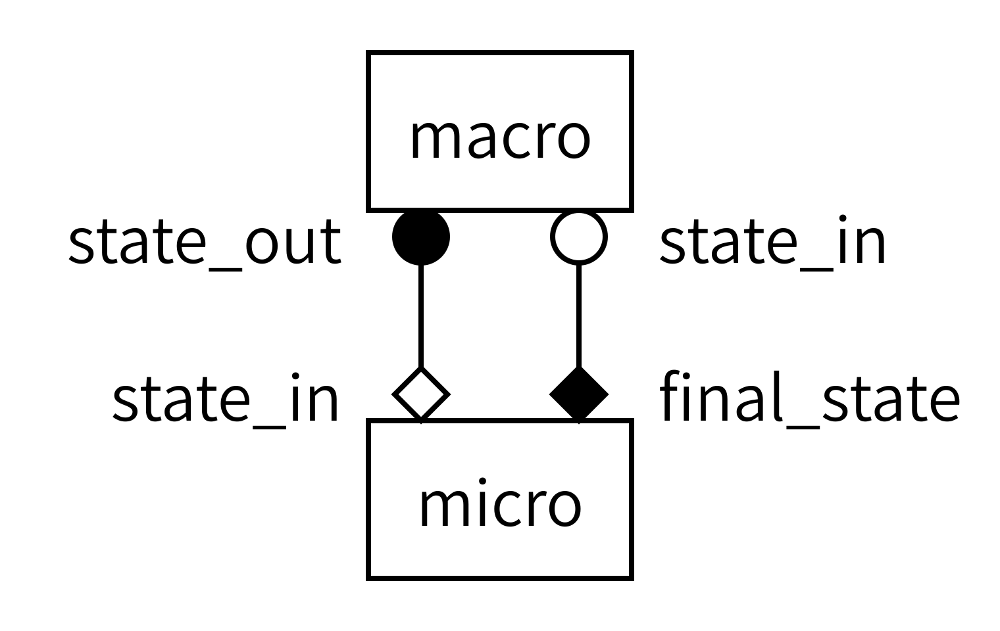

::: questions

- How do you couple multiple sub-models using MUSCLE3?
- How do you run a coupled simulation with MUSCLE3?

:::

::: objectives

- Demonstrate how MUSCLE3 implements the Multiscale Modelling and Simulation Language (MMSL)
- Configure a coupled simulation with MUSCLE3
- Run a coupled simulation using MUSCLE3

:::

## Introduction

We managed to connect one of our sub-models, the reaction model, to MUSCLE. In order to make a coupled simulation, we need at least two models. The second model here is the diffusion model. We prepared it for you, adding the necessary MUSCLE bindings and comments similar to what we did for the reaction model. You can open it from `diffusion.py`.

## Investigating the macro model

::: challenge

## Challenge 1: Investigating the diffusion model

The `diffusion.py` file contains a couple of functions, as well as a few lines of code that may come in useful later. For now, let's focus on the `diffusion` function.

- Compared to the `reaction` function you made previously, what is different, other than the mathematics of the model itself?

::: solution

- The ports are named differently, and are attached to different operators
- The send and receive statements are now within the state update loop

:::
:::

## Connecting the models together

With both models defined, we now need to instruct MUSCLE3 on how to connect them together. Recall the gMMSL diagram from the previous episode (with port names, this time):

{alt='gMMSL diagram for the reaction-diffusion model. Two boxes labeled macro and micro represent the two submodels. A line connects a filled circle labeled state_out on macro to an open diamond labeled state_in on micro. A second line connects a filled diamond labeled final_state on micro to an open circle labeled state_in on macro.'}

Since diagrams aren’t valid Python, we need an alternative way of describing this model in our code. For this, we will create a MUSCLE configuration file written in the yMMSL language. This file tells the MUSCLE manager about the existence of each submodel and how it should be connected to the other components.

::: challenge

## Challenge 2: Creating the yMMSL file

Open the file `reaction_diffusion.ymmsl`. In it, you'll find an incomplete yMMSL description of the coupled simulation, as shown below. Your challenge? Complete it!

Tip: remember that this is a textual description of the diagram above. All the information you need is in there.

```yaml
ymmsl_version: v0.1

model:
  name: reaction_diffusion

  components:
    macro:
      implementation: diffusion
      ports:
        o_i: state_out
        ...

    ...
      implementation: reaction
      ...

  conduits:
    macro.state_out: micro.initial_state
    ...
```


::: solution

```yaml
ymmsl_version: v0.1

model:
  name: reaction_diffusion_python

  components:
    macro:
      implementation: diffusion_python
      ports:
        o_i: state_out
        s: state_in

    micro:
      implementation: reaction_python
      ports:
        f_init: initial_state
        o_f: final_state

  conduits:
    macro.state_out: micro.initial_state
    micro.final_state: macro.state_in
```

First, we describe the two components in this model. Components can be submodels, or helper components that convert data, control the simulation, or otherwise implement required non-model functionality. The name of a component is used by MUSCLE as an address for communication between the models. The implementation name is intended for use by a launcher, which would start the corresponding program to create an instance of a component. It is these instances that form the actual running simulation. In this example, we have two submodels: one named macro and one named micro. Macro is implemented by an implementation named diffusion, while micro is implemented by an implementation named reaction.

Second, we need to connect the components together. This is done by conduits, which have a sender and a receiver. Here, we connect sending port `state_out` on component `macro` to receiving port `initial_state` on component `micro`.

:::
:::

## Adding settings

The above specifies which submodels we have and how they are connected together. Next, we need to configure them by adding the settings to the yMMSL file. These will be passed to the models, who get them using the `Instance.get_settings()` function. Go ahead and add them to your `reaction_diffusion.py`:

```yaml
settings:
  micro.t_max: 2.469136e-6
  micro.dt: 2.469136e-8
  macro.t_max: 1.234568e-4
  macro.dt: 2.469136e-6
  x_max: 1.01
  dx: 0.01
  k: -4.05e4    # reaction parameter
  d: 4.05e-2    # diffusion parameter
```

Look at the names of the settings. Does anything stand out to you?

## Specifying resources

Finally, we need to tell MUSCLE3 whether and if so how each model is parallelised, so that it can reserve adequate resources for each component. In this case, the models are single-threaded so that is what we specify. Again, add this to your file.

```yaml
resources:
  macro:
    threads: 1
  micro:
    threads: 1
```

Note that we specify resources for each component, not for each implementation.

## Launching the simulation

This gives us all the pieces needed to construct a coupled simulation. All we need is the two model functions and the configuration, then we can connect them together and run the whole thing. The model functions we can import from the files we saw before:

```python
from diffusion import diffusion
from reaction import reaction
```

To load the configuration, we use the `load()` function from the `ymmsl` module that comes with MUSCLE3:

```python
from pathlib import Path
import ymmsl

configuration = ymmsl.load(Path('reaction_diffusion.ymmsl'))
```

Finally, we need to create a connection from the names of the implementations listed in the yMMSL file to the Python functions that are those implementations:

```python
implementations = {'reaction': reaction, 'diffusion': diffusion}
```

And then we can ask MUSCLE3 to start the coupled simulation:

```python
from libmuscle.runner import run_simulation.

run_simulation(configuration, implementations)
```

You will find a `coupled_model.py` file with the others, which implements the above. It also configures Python's logging subsystem to give us a bit more log output.

::: challenge

## Challenge 3: Running the coupled simulation

Run the `coupled_model.py` script and see if it works. It should show a plot on the screen showing the concentration over time. If not, try to find the problem! You should have a `muscle_manager.log` file, and maybe a `muscle3.micro.log` and `muscle3.macro.log` to help you figure out what went wrong.

::: solution

$ python3 coupled_model.py

:::
:::

::: keypoints

- Models may differ in which ports they have and when they send and receive
- The yMMSL file discribes components, conduits, settings and resources
- Running the coupled simulation can be done from a Python script

:::


## Bonus exercise

TODO: do this or not?

- turn reaction.py and diffusion.py into stand-alone Python programs
- put the yMMSL into a separate YAML file
- add implementations: section pointing to those files
- run using muscle_manager --start-all


?
